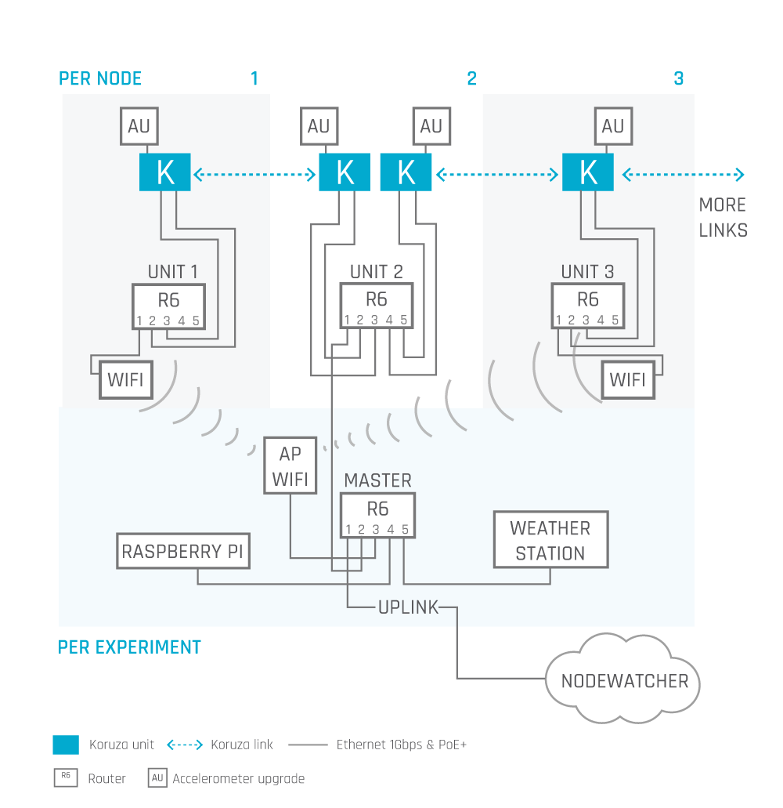
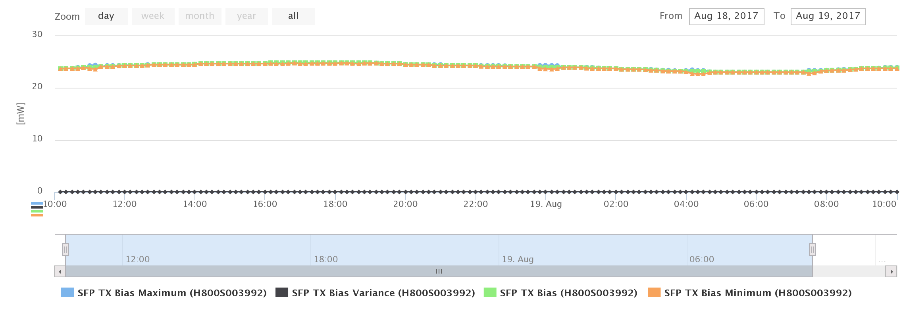

# KORUZA Pro scientific experiment
[KORUZA Pro](http://koruza.net) free-space optical / wireless optical system may be used in a wide range of networking application in urban environments as well as in a range of specialized applications and scientific experiments. This experiment is designed to provide a complete solution to study the performance and stability of wireless optical communication in a number of settings. It consists of wireless optical units, networking equipment for testing purposes, online monitoring platform and data-analysis software.

## Overall experiment design
The KORUZA Pro experiment can consist from 1 to 100 interconnected wireless optical links in a single coordinated experimental setup. One can deploy the units on any type of structure and monitor data over a longer period of time for the purposes of testing and scientific study of:
 * KORUZA Pro performance in a particular deployment
 * evaluation of free-space optical (FSO) system performance in various environments
 * free-space optical channel studies and evaluation
 * design requirement evaluation for custom FSO system development
 * testing and development of auto-tracking algorithms / pointing and acquisition systems (PAT)
 
The following parameters can be monitored with the setup in real time:
 * FSO system variables:
   * Transmitted optical power (TX power)
   * Transmitter bias current (TX bias)
   * Received optical power (RX power)
   * Transceiver temperature (Temperature)
   * Transceiver supply voltage (VCC)
 * FSO link variables
   * Link packet loss (Packet loss)
   * Link round-trip-time (RTT)
   * Camera capture of the link path
 * Control system variables
   * Motor position X and Y, translates to angular link pointing
   * System memory
   * System load
   * System processes
   * Alignment algorithm variables
 * Accelerometer variables
 * Environmental variables
   * Air temperature
   * Humidity
   * Wind direction
   * Wind speed
   * UV irradiance
   * Rain fall
 * Custom variables
   * Custom sensors can be integrated with the setup upon request

## Hardware setup
Typical setup of the experiment consists of a number of interconnected nodes, each consisting of one or multiple KORUZA Pro units, test network equipment and sensors. Detailed setup is optimized for each experiment.

## Measurement processing and handling
The experiment is designed such that all significant events are captured and the data volume is minimized. The standard setup consists of a data point for every variable every 60s - [Implementation details](https://github.com/IRNAS/sfp-nodewatcher-agent)
 * FSO system variables - measurement every 0.5s, values aggregated every 60s into: -  [Implementation details](https://github.com/IRNAS/sfp-driver)
   * Variable minimum
   * Variable maximum
   * Variable average
   * Variable variance - (take square root for std deviation)
 * FSO link variables
   * Nominal value over the 60s interval reported
 * Control system variables
   * Nominal value reported 
 * Accelerometer variables -  [Implementation details](https://github.com/IRNAS/koruza-accelerometer-module)
   * Raw accelerometer values acquired for 4s, fourier analysed for frequency ranges then for every 60s calculated:
     * Variable minimum (typically not displayed)
     * Variable maximum
     * Variable average
  * Environmental variables
    * Nominal value reported
    

## Online real-time monitoring platform Nodeawtcher
Platform Nodewatcher is utilized to join all the measurements in an user-friendly interface, enabling real-time monitoring of the experiment, custom time-range data inspection and export for analysis. The above listed variables are measured as described and displayed on the graphs, samples of which are shown here along with a short introduction of what useful information about the operation we may be able to deduce from them. These data is collected from units connected to monitoring platform https://kw.koruza.net. 

## Sample graphs and information on potential results
Hereby we display sample graphs for a few hours of system operation and discuss what we may be able to see from them.

### RX optical power
RX optical power is the measure of optical intensity at the receiver as per SFP MSA standard. Note there may be absolute offset of up to 3dB in these measurements when correlated to 1 mW and thus it is not unusual to observe a unit may be receiving more then the opposite unit is transmitting. Variation in the intensity as such is what we are usually most interested in. From these values we may observe a number of things, most notably if both Average and Maximum/Minimum values are changing consistently, then the link is stable but may be affected by slow thermal movements of structures it is mounted on. Provided there are significant differences between minimum and maximum, then the link is experiencing either mechanical vibration at receive or transmit side or turbulence in the optical channel as such. The separate graph of Variance can be used to investigate how much the values have been chancing over the reporting period.

Typical values for KORUZA Pro are -6dBm to -20dBm for an operational link without packet loss. Same values are shown on two graphs, one in dB scale and one in mW scale. Variance is plotted separately.

### TX optical power and bias
TX optical power and bias current are observed to make sure output is constant and no significant variations are expected, except small currections in bias with the changes in temperature.

### Transceiver temperature and VCC
Transceiver temperature and vcc are monitored to observe the performance of the system under varying conditions, mainly temperature. Vcc is expected to be about 3300mV and Temperature typically ranges from 30 to 70 degree Celsius.

### Packet loss and RTT
Packet loss and RTT are measured over the wireless optical link to monitoring its performance over time and correlate events where there is notable packet loss to other environmental factors. For example here we can observe two events with some packet loss for a brief period of time, which correspond to loss in optical power shown above.

### Motor position
Motor position indicates the actual position of the motors inside KORUZA Pro unit, which is changed either manually though the web interface or automatically is a tracking algorithm is operating.

### System info
The information from the Raspberry Pi Compute module board running Raspbian Linux is shown here to evaluate for possible software issues, generally observable are memory leaks or significant system load events.

### Accelerometer
Accelerometer module may be used to correlated the link performance to mechanical stability. From these measurement we can deduce how stably KORUZA Pro is mounted and if link performance has been degraded due to the stability. Measurements are split in 4 user-defined frequency ranges, R1 to R4, that enable one to focus on particular range of frequencies.

### Weather
Weather is observed via a wireless weather station best mounted next to one of the KORUZA Pro units and the values are monitored. From temperature and humidity we may evaluate the FSO channel disturbances and predict fog events, wind may affect the stability of the system, rain may introduce temporary fade events and UV irradiance may be correlated to direct sunlight exposure and heating of the mechanical elements.

## Licensing

Software and scripts of koruza-experiment-v2 are licensed under [GNU GENERAL PUBLIC LICENSE v3](https://www.gnu.org/licenses/gpl-3.0.en.html).

KORUZA Pro documentation, including koruza-experiment-v2, is licensed under [Creative Commons Attribution-ShareAlike 4 .0 Unported License](https://creativecommons.org/licenses/by-sa/4.0/legalcode).

Open data generated by KORUZA Pro project, including data generated by koruza-experiment-v2, is licensed under [CC0]( https://creativecommons.org/publicdomain/zero/1.0/).

What this means is that you can use this hardware, firmware and software, data and documentation without paying a royalty and knowing that you'll be able to use your version forever. You are also free to make changes but if you share these changes then you have to do so on the same conditions that you enjoy.

KORUZA, KORUZA Pro and IRNAS are all names and marks of Institute IRNAS Rače. You may use these names and terms only to attribute the appropriate entity as required by the Open Licence referred to above. You may not use them in any other way and in particular you may not use them to imply endorsement or authorization of any hardware that you design, make or sell.

